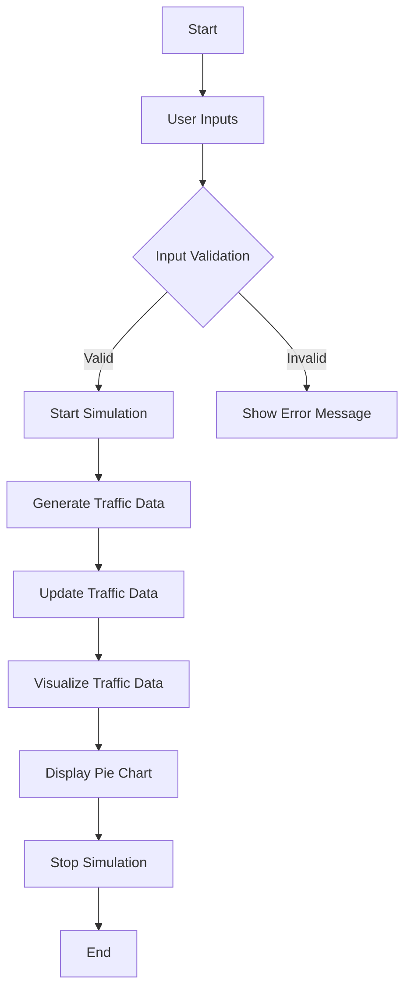
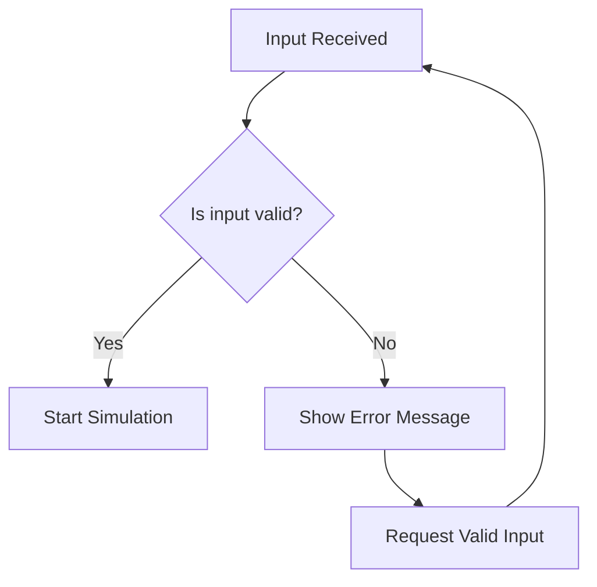

# Network-Security-Visualizer-Project
This is a college project which is created to show the learning outcome of python and its libraries (numpy,matplotlib and tkinter) 24CAH-606

## Project Overview

The Network Security Visualizer is a simulation tool designed to demonstrate network traffic behaviors, including normal and malicious activities. This tool generates random IP addresses and simulates network traffic, allowing users to visualize the types of traffic present in a simulated network environment. The project uses Python with Tkinter for the GUI and Matplotlib for visualization.

## Features

- **Simulated Network Traffic**: Generates random IP addresses and port numbers, simulating both normal and attack traffic.
- **Configurable Simulation**: Users can specify the number of devices and the percentage of attack traffic.
- **Visualization**: Provides a pie chart visualization of the traffic data, displaying the proportion of normal vs. malicious traffic.
- **Threaded Execution**: Runs the simulation in a separate thread to keep the GUI responsive.

## Architecture

The project is divided into two main classes:

1. **NetworkTrafficSimulator**: Handles the generation of network traffic data.
2. **NetworkSecurityVisualizer**: Manages the GUI and user interactions.

### Flowchart of the Project

### Decision Tree for Input Validation :

## Conclusion

The Network Security Visualizer project serves as an educational project for understanding numpy, matplotlib, tkinter, network traffic patterns, networking activities with python. It can be extended to incorporate more complex simulations and additional visualization techniques.
